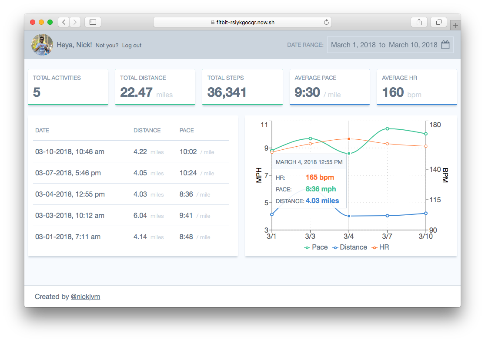

# Fitbit Runner's Dashboard
View your Fitbit health and running activity history based on a selected date range

This has been tested with data logged using a Fitbit Charge 2. Other devices may or may not work depending on the data collected. PRs are welcomed if you notice an issue with your device!

This dashboard only tracks running activities (the pace threshold is 12:00 minute miles or less). There may be a feature in the future to customize this threshold.

[DEMO](https://fitbit-rsiykgocqr.now.sh/) (deployed with `now.sh`)

## Built with
* [next.js](https://github.com/zeit/next.js)
* [recharts](https://github.com/recharts/recharts)
* [react](https://github.com/facebook/react)
* [node](https://github.com/nodejs/node)
